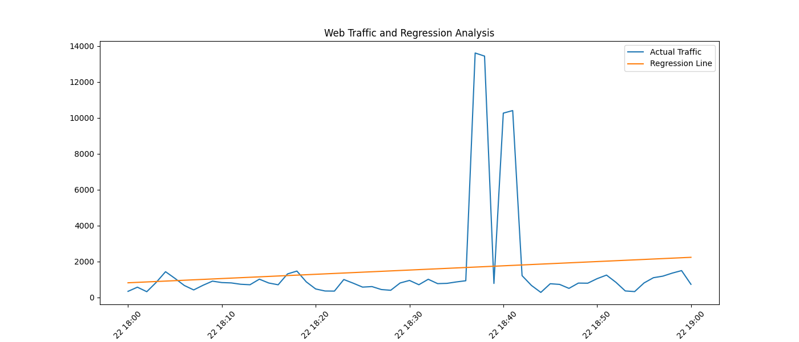

# DDoS Detection Using Regression Analysis

## 1. Introduction

The objective of this task is to analyze a web server log file and detect potential Distributed Denial-of-Service (DDoS) attack intervals using regression-based anomaly detection.

DDoS attacks typically manifest as abnormal spikes in traffic volume compared to normal baseline behavior. To detect such anomalies, statistical modeling and residual analysis were applied.

---

## 2. Provided Log File

The analyzed web server log file was provided at:

http://max.ge/aiml_final/g_surguladze25_82519_server.log

A copy of the file is also included in this repository:

`task_3/server.log`

---

## 3. Data Extraction and Preprocessing

The log file contains HTTP request records with timestamps enclosed in square brackets.

Timestamps were extracted using regular expressions and converted into datetime format.

### Log Parsing

```python
with open(log_file, "r") as file:
    for line in file:
        match = re.search(r"\[(.*?)\]", line)
        if match:
            timestamps.append(match.group(1))
```

After extraction, timestamps were converted and invalid entries removed.

Requests were grouped per minute to compute traffic frequency.

### Aggregation Per Minute

```python
df["minute"] = df["timestamp"].dt.floor("min")
requests_per_minute = df.groupby("minute").size().reset_index(name="request_count")
```

---

## 4. Regression Model

To model normal traffic behavior, Linear Regression was applied.

Let:

- X = time index
- y = request count per minute

The regression model estimates baseline traffic trends over time.

### Linear Regression

```python
model = LinearRegression()
model.fit(X, y)
pred = model.predict(X)
```

Residuals were computed as:

Residual = Actual Traffic − Predicted Traffic

A statistical threshold was defined as:

Threshold = mean(residuals) + 3 × std(residuals)

Minutes exceeding this threshold were classified as potential DDoS activity.

### Residual-Based DDoS Detection

```python
residuals = y - pred
threshold = residuals.mean() + 3 * residuals.std()
requests_per_minute["is_ddos"] = residuals > threshold
```

---

## 5. Visualization

The regression model and actual traffic were visualized to identify abnormal spikes.

- Blue line: Actual traffic
- Orange line: Regression baseline



Significant deviations above the regression line indicate anomalous behavior.

---

## 6. Identified DDoS Intervals

The following time intervals were identified as potential DDoS attacks:

- 2024-03-22 18:37:00 (+04:00) – 13,604 requests
- 2024-03-22 18:38:00 (+04:00) – 13,432 requests
- 2024-03-22 18:40:00 (+04:00) – 10,256 requests
- 2024-03-22 18:41:00 (+04:00) – 10,398 requests

Overall detected DDoS window:

**2024-03-22 18:37 – 18:41 (+04:00)**

These request counts significantly exceed expected traffic levels predicted by the regression model.

---

## 7. Conclusion

Regression-based residual analysis successfully identified abnormal traffic spikes consistent with DDoS attack behavior.

The attack occurred between 18:37 and 18:41 on March 22, 2024.

This approach demonstrates how statistical modeling combined with threshold-based anomaly detection can effectively identify coordinated traffic attacks in web server logs.

The full implementation is available in:

`task_3/ddos_regression.py`
